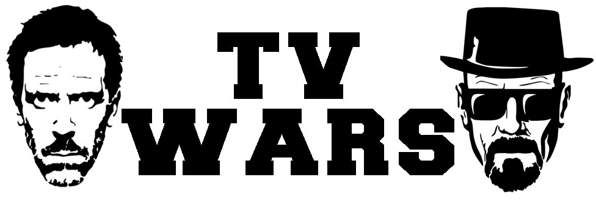

# PROYECTO FINAL TALLER 1

## NOMBRE DEL PROYECTO: Mini Juego de rol con C#

### AUTOR: SANCHEZ LUIS HERNAN

### DESCRIPCIÓN DEL PROYECTO Y REGLAS DEL JUEGO

El proyecto consiste en cumplir con los objetivos y rúbricas establecidos en las instrucciones de la creación del mismo. Se programó un mini juego de rol con C#: En este caso se optó por elegir personajes de series de TV y servicios de streaming, los cuales se ofrecen para la elección. 

### MODO DE JUEGO

Al inicio se muestra un Menu para elegir personajes, una vez presionada la opcion, se mostrara una lista de los mismos para poder seleccionar el personaje con el cual se va a Jugar.

Una vez elegido uno de los personajes, se continúa con la ejecución enfrentando a dicho personaje con los demás en la lista uno por uno. El jugador por cada batalla tiene la posibilidad de aumentar su ataque a traves de una bonificacion que se realiza al llamar a la API que proporciona un lista de episodios segun la serie del personaje, cada episodio posee un Rating, este mismo se duplica y se suma al ataque del jugador. Para ello se pregunta antes si el usuario desea ingresar los nombres de los episodios (favoreciendo al jugador al saber cuales episodios tuvieron mucho rating y cuales no) o si no los conoce se obtendra un episodio aleatorio de la lista.

Cada ataque en la batalla se realiza por turnos en los cuales un personaje ataca y otro se defiende a través de cálculos matemáticos donde se tienen en cuenta las características de ambos personajes para calcular el daño provocado, hasta que uno pierde la salud completamente.

Los calculos son:

  ataque = Destreza * Fuerza * Nivel + Bonificacion

  efectividad = ValorAleatorio(1, 101);

  defensa = Armadura * Velocidad

  danioProvocado = ((ataque * efectividad) - defensa) / ajuste;

  Salud = Salud - danioProvocado;

  El puntaje acumulado en cada batalla se calcula sumando la salud con la que queda el jugador en cada batalla, cuanto menos daño recibio mas puntaje obtendrá.
  

Si el jugador gana, su salud es restaurada para comenzar nuevamente otra batalla y así hasta llegar al último personaje de la lista. Si este último contrincante es derrotado, se consagra al jugador como Ganador de la partida. Si pierde una batalla, pierde inmediatamente la partida. Si ha finalizado y ganado la partida, se calcula si el puntaje acumulado entra en la lista de historial de ganadores. Si es así, se pide el ingreso del nombre y se guarda en la lista.

### USO DE LA API

Se seleccionó la API de la lista proporcionada en el repositorio GitHub: [Public APIs](https://github.com/public-apis/public-apis)

API proporcionada por el sitio TVMaze de información de series, películas, etc.
- Sitio: [TVMaze API](https://www.tvmaze.com/api)

En este caso, el Endpoint utilizado es el que proporciona una lista de la información de los episodios de la serie obtenida primero con el endpoint para buscar la serie por el nombre, extrayendo el id:

- **Endpoint para buscar serie** - retorna lista de series que coincidan con la palabra - una de las info es el id:
  - `https://api.tvmaze.com/search/shows?q=palabra`

- **Endpoint para obtener lista de episodios e información de los mismos por el id de la serie**:
  - `https://api.tvmaze.com/shows/{id}/episodes`

Al obtener la lista de episodios, uso el campo Rating -> Average para obtener el promedio del episodio y lo uso para calcular (aumentar como bonificación por batalla) el ataque del jugador, como un plus más para poder ganar una batalla.
